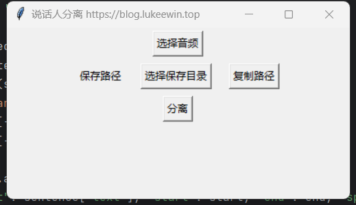

# 0. 效果演示
 \
演示视频可以访问 https://www.bilibili.com/video/BV1oxrcYuELK \
# 1. 说明
这是基于开源的 FunASR 实现的说话人分离的 GUI 项目，可以在支持图形界面中的任意 PC 端运行 \
要求 python version >= 3.8 \
支持运行在 Windows、MacOS、Linux 系统 \
本项目适合个人电脑使用，如果要在生产服务器中部署，并且需要并发处理，可到我博客中联系我
# 2. 开发日志
2023-11-14 对选择的多个音频分离不同的人声 \
2024-01-04 保存每个说话人对应的内容
# 3. 安装
执行下面命令来安装依赖
```shell
pip install -U funasr modelscope ffmpeg-python
```
此外还需要安装 torch，可以到 torch 官方中根据自己电脑情况安装不同版本的 torch \
安装 ffmpeg，可以到 github 中搜索 ffmpeg，下载解压后，配置环境变量
# 4. 功能
1. 支持对指定的单个或者多个音频中不同的说话人讲的话进行分离，分别归类到不同的目录中 \
2. 保存每个说话人对应的内容 \
如果你需要对视频进行切片，需要修改源代码，欢迎有能力的大佬提交 Pr
# 5. 模型下载
执行下面程序，会自动下载模型到当前用户 .cache/modelscope/hub/iic/ 目录中
```shell
python download_model.py
```
# 6. 联系
可以添加交流群 746213237 \
个人技术分享博客：https://blog.lukeewin.top \
如果是小白，不懂代码，可以点击[这里](https://item.taobao.com/item.htm?ft=t&id=853452834970)

